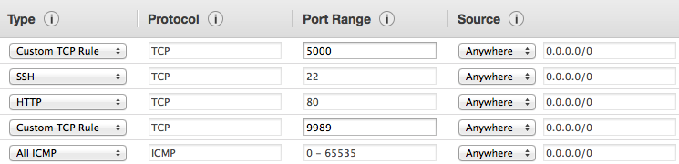

This is the configuration for ClusterHQ's `Buildbot <http://buildbot.net/>`_.

The Buildbot master is deployed as a Docker container running on an AWS EC2 instance.

Most of the slaves are EC2 latent slaves started by the master.
Some slaves, such as an OS X slave, must be started manually.

Buildbot schedulers start builds triggered by a push to any branch in the Flocker repository or by forced builds.
After a new push to a branch, Buildbot waits a number of seconds before starting a build,
in case another push arrives shortly afterwards.

Most builds are tested as merges against the Flocker ``master`` branch.

Install dependencies
--------------------

The code uses Fabric to start and manage the Buildbot master.

To install dependencies::

   $ pip install pyyaml
   $ pip install fabric

Create the configuration
------------------------

The configuration requires secret data that must not be committed to the Github repository.
The secret data is provided in a file ``config.yml``.

A sample configuration is provided in the file ``config.yml.sample``.

The config file for the ClusterHQ master can be found in the ``config@build.clusterhq.com`` file in LastPass.
If you have the ``lastpass`` command-line client installed, you can use Fabric to download the current config::

   $ fab getConfig

Fabric passes these variables to Buildbot via a Docker environment variable as JSON.

Test changes on staging server
------------------------------

Changes to the Buildbot master can be tested on a staging machine.

Create a staging Docker image
=============================

To create a new staging image in the Docker registry, update the ``staging`` branch and push to Github.
The Docker registry will automatically build an image based on the ``staging`` branch of https://github.com/ClusterHQ/build.clusterhq.com whenever it is updated.
To make the ``staging`` branch the same as a development branch, run the following commands::

   git checkout staging
   git pull
   git reset --hard <other-branch>
   git reset --soft HEAD@{1}
   git commit
   git push

After pushing a change to ``staging``, it takes about 10 minutes for the Docker image build to finish.
The status is available `here <https://registry.hub.docker.com/u/clusterhq/build.clusterhq.com/builds_history/46090/>`_.
You will need to a member of the ``clusterhq`` group on Docker Hub in order to click on build id's to see detailed information about build progress or errors.

Create a staging server
=======================

Create an AWS EC2 Security Group to allow inbound traffic as shown below.

         SSH, TCP Protocol, Port Range 22, Source Anywhere, 0.0.0.0/0
         HTTP, TCP Protocol, Port Range 80, Source Anywhere, 0.0.0.0/0
         Custom TCP Rule, TCP Protocol, Port Range 9989, Source Anywhere, 0.0.0.0/0
         All ICMP, ICMP Protocol, Port Range 0-65535, Source Anywhere, 0.0.0.0/0

The Security Group should allow all outbound traffic.

`Install and configure boto <http://boto.readthedocs.org/en/latest/getting_started.html>`_ to allow scriptable access to AWS.

Run ``python start-aws.py``.
This command will display the external IP address of the EC2 instance.

Run ``python start-aws.py --help`` to see the available options to this command.

Create staging configuration
============================

Create a file ``staging.yml`` from the ``config.yml``.

Make the following changes to the ``staging.yml`` file:

#. To use the new EC2 instance, change the ``buildmaster.host`` config option to the IP of the EC2 instance.

#. To prevent reports being published to the Flocker Github repository, change the ``github.report_status`` config option to ``False``.

#. To use the staging Docker image, add a ``buildmaster.docker_tag`` config option with the value ``staging``.

Start staging server
====================

To start a Buildbot master on this machine run::

   $ fab start:staging.yml

To update a slave on this machine, run::

   $ fab update:staging.yml

Log in to the EC2 instance with the credentials from the ``auth`` section of the config file.

The staging setup is missing the ability to trigger builds in response to Github pushes.

The staging master will start Linux slaves on AWS EC2 automatically.
To start a Mac OS X slave, see below.

Deploy changes to production server
-----------------------------------

Ensure the dependencies have been installed and configuration created, as described above.

To create a new ``latest`` image in the Docker registry, update the ``master`` branch and push to Github.
The Docker registry will automatically build an image based on the ``master`` branch of https://github.com/ClusterHQ/build.clusterhq.com whenever it is updated.

After pushing a change to ``master``, it takes about 10 minutes for the Docker image build to finish.
The status is available `here <https://registry.hub.docker.com/u/clusterhq/build.clusterhq.com/builds_history/46090/>`_.
You will need to a member of the ``clusterhq`` group on Docker Hub in order to click on build id's to see detailed information about build progress or errors.

The production instance is accessed using a key from https://github.com/hybridlogic/HybridDeployment (this repository is not publicly available).
Add the HybridDeployment master key to your authentication agent::

   $ ssh-add /path/to/HybridDeployment/credentials/master_key

Check if anyone has running builds at http://build.clusterhq.com/buildslaves.

Announce on Zulip's ``Engineering > buildbot`` stream that Buildbot will be unavailable for a few minutes.

Update the live Buildbot to the latest Docker image (this may take some time)::

   $ fab update

To view the logs::

   $ fab logs

To restart the live Buildbot with the current image::

   $ fab restart

Wheelhouse
----------

There is a wheelhouse hosted on s3 (thus near the buildslaves).
Credentials [1]_ for ``s3cmd`` can be configured using ``s3cmd --configure``.
It can be updated to include available wheels of packages which are in flocker's ``setup.py`` by running the following commands::

   python setup.py sdist
   pip wheel -f dist "Flocker[doc,dev]==$(python setup.py --version)"
   s3cmd put -P -m "Content-Type:application/python+wheel" wheelhouse/*.whl s3://clusterhq-wheelhouse/fedora20-x86_64
   s3cmd ls s3://clusterhq-wheelhouse/fedora20-x86_64/ | sed 's,^.*/\(.*\),<a href="\1">\1</a> ,' | s3cmd put -P -m "text/html" - s3://clusterhq-wheelhouse/fedora20-x86_64/index

The buildslave is constructed with a ``pip.conf`` file that points at https://s3-us-west-2.amazonaws.com/clusterhq-wheelhouse/fedora20-x86_64/index.

.. [1] Create credentials at https://console.aws.amazon.com/iam/home#users.

Slave AMIs
----------

There are two slave AMIs.
The images are built by running ``slave/build-images``.
This will generate images with ``staging-`` prefixes.
These can be promoted by running ``slave/promote-images``.

The images are based on the offical fedora 20 image (``ami-cc8de6fc``) with ``slave/cloud-init-base.sh``.
Each image uses `slave/cloud-init.sh` with some substitutions as user-data, to start the buildbot.

``fedora-buildslave``
  is used for most builds, and has all the dependencies installed,
  including the latest release of zfs (or a fixed prerelease, when there are relevant bug fixes).
  The image is built by running :file:`slave/cloud-init-base.sh` and then installing zfs.
``fedora-buildslave-zfs-head``
  is used to test against the lastest version of zfs.
  It has all the dependencies except zfs installed, and has the latest version of zfs installed when an
  instance is created.  The image is built by running :file:`slave/cloud-init-base.sh`.

Both images have :file:`salve/cloud-init.sh` run on them at instance creation time.

Vagrant Builders
----------------

The vagrant builders upload the boxes to Amazon S3.
The bucket (`s3://clusterhq-dev-archive/vagrant`) is set to expire objects after two weeks.

To set this lifecycle setting:

* Right click on the bucket,
* Properties,
* Lifecycle > Add rule,
* "Apply the Rule to", select "A Prefix" and fill in "vagrant/",
* Choose "Action on Objects" "Permanently Delete Only", after 14 days.

Mac OS X Buildslave
-------------------

Configuring an OS X machine to run tests requires root priviledges and for SSH to be configured on this machine.

To configure this machine run::

   fab -f slave/osx/fabfile.py --hosts=${USERNAME}@${OSX_ADDRESS} install:0,${PASSWORD},${MASTER}

The tests do not run with root or administrator privileges.

Where ``${USERNAME}`` is a user on the OS X machine, and ``${PASSWORD}`` is the password in ``slaves.osx.passwords`` from the ``config.yml`` or ``staging.yml`` file used to deploy the BuildBot master on hostname or IP address ``${MASTER}``.

For testing purposes, or if you do not have root privileges, run the following commands to start a build slave (set ``MASTER`` and ``PASSWORD`` as above):

.. code:: shell

   curl -O https://bootstrap.pypa.io/get-pip.py
   python get-pip.py --user
   ~/Library/Python/2.7/bin/pip install --user buildbot-slave virtualenv
   ~/Library/Python/2.7/bin/buildslave create-slave ~/flocker-osx "${MASTER}" osx-0 "${PASSWORD}"
   export PATH=$HOME/Library/python/2.7/bin:$PATH
   twistd --nodaemon -y flocker-osx/buildbot.tac

There is a VMware Fusion OSX VM configured, for running homebrew installation tests.
It is configured with a ``nat`` network, with a static IP address,
and the buildslave user has a password-less ssh-key that can log in to it.

Fedora hardware builders
------------------------

The following builders need to run on Fedora 20 on bare metal hardware:

* flocker-vagrant-dev-box
* flocker-vagrant-tutorial-box
* flocker/acceptance/vagrant/fedora-20
* flocker/installed-package/fedora-20

To create a Rackspace OnMetal slave to serve this purpose:

* Log into https://mycloud.rackspace.com,
* Create Server > OnMetal Server,
* Give the server an appropriate name,
* Choose the following options: Image: OnMetal - Fedora 20 (Heisenbug), Flavor: OnMetal Compute, An SSH key you have access to
* Create Server,
* When this is complete there will be a command to log into the server, e.g. ``ssh root@${ONMETAL_IP_ADDRESS}``.

To configure any Fedora 20 bare metal machine (e.g. on OnMetal as above)::

   fab -f slave/vagrant/fabfile.py --hosts=root@${ONMETAL_IP_ADDRESS} install:0,${PASSWORD},${MASTER}

Where ``${PASSWORD}`` is the password in ``slaves.fedora-vagrant.passwords`` from the ``config.yml`` or ``staging.yml`` file used to deploy the BuildBot master on hostname or IP address ``${MASTER}``.

PistonCloud
-----------

The following builders need to run on Centos-7 on PistonCloud:

* flocker-openstack-pistoncloud

To create this machine you'll need to access various machines within pistoncloud via an "SSH jump host".

The machines are referred to here as:
 * pistoncloud-jumphost: The server through which you will connect to servers inside the pistoncloud network.
 * pistoncloud-novahost: The server which has ``novaclient`` and associated command line tools installed.
 * pistoncloud-buildslave: The server which we have created to run the ClusterHQ buildslave.

The easiest way to access these machines is to create an SSH config file containing the hostnames and usernames that you will use to access the machines.
Here is an example of such a file::

   Host pistoncloud-jumphost
        IdentityFile ~/.ssh/id_rsa_pistoncloud
        User <jumphost_username>
        HostName <jumphost_public_hostname_or_ip_address>

   Host pistoncloud-novahost
        User <novahost_username>
        HostName <novahost_public_hostname_or_ip_address>
        ProxyCommand ssh pistoncloud-jumphost nc %h %p

With this ``ssh-config`` file saved to ``~/.ssh/config``, run::

   fab -f slave/pistoncloud/fabfile.py new_server:clusterhq_flocker_buildslave,clusterhq_richardw

Then find the IP address of the new machine::

   $ ssh pistoncloud-novahost
   [pistoncloud-novahost ~] $ nova list  | grep clusterhq_flocker_buildslave
   | ad6c426c-c862-4ab4-8ee8-941f6425dd77 | clusterhq_flocker_buildslave            | ACTIVE | tmz-mdl-net1=172.19.139.35 |

Add that address to your ssh config file::

   Host pistoncloud-buildslave
        IdentityFile ~/.ssh/id_rsa_pistoncloud_buildslave
        User <buildbot_username>
        HostName <buildbot_internal_ip_address_from_previous_step>
        ProxyCommand ssh pistoncloud-novahost nc %h %p

Check that you can log in to the new buildslave::

   ssh pistoncloud-buildslave

Now configure the new server by running the following ``fabric`` task::

   fab -f slave/pistoncloud/fabfile.py install:0,clusterhq_pistoncloud_buildslave,${PASSWORD},${BUILDMASTER}

Where ``${PASSWORD}`` is the password in ``slaves.piston_buildslave.passwords`` from the ``config.yml`` or ``staging.yml`` file,
and ``${MASTER}`` is the IP address of the BuildBot master that you want this buildslave to connect to.

This step will install:
 * the buildbot buildslave package on the server and
 * a ``buildslave`` user account and
 * a ``clusterhq_pistoncloud_buildslave`` systemd service which will be started automatically.

Monitoring
----------

There is monitoring setup for buildbot, using `prometheus <http://prometheus.io/>`_.
It is configured to poll ``/metrics`` on both the production and staging buildbots.
It is currently running alongside both ``build.clusterhq.com`` and ``build.staging.clusterhq.com``.
It can be started by::

   fab --hosts=${USERNAME}@${HOST} startPrometheus

Disk Usage and Clearing Space
=============================

The Buildbot master stores artifacts from previous builds.
A script is run daily to delete some data which is 14+ days old.

To find where space is being used run::

   $ su -u root
   $ cd /
   # The following shows directory contents sorted by size
   $ du -sk * | sort -n
   # cd into any suspiciously large directories, probably the largest, and
   # repeat until the culprit is found.
   $ cd suspiciously-large-directory

Then fix the problem causing the space to be filled.

A temporary fix is to delete old files.
The following deletes files which are 7+ days old::

   $ find . -type f -mtime +7 -exec unlink {} \;

Alternatively it is possible to increase the volume size on the Amazon S3 instance hosting the BuildBot master.

The following steps can be used to change a volume size:

- Stop the S3 instance.
- Snapshot the volume being used by the instance.
- Create a volume from the snapshot with the desired size.
- Detach the old volume.
- Attach the new volume
- Start the instance.
